# Architecture — Pokedex APK

```mermaid
graph TB
    subgraph ENTRY["🚀  Entry Point"]
        MA["MainActivity\n(single Activity)"]
        APP["PokedexApplication\n(DI root — creates Repository\n& SettingsRepository singletons)"]
        MA --> APP
    end

    subgraph NAV["🧭  Navigation Layer"]
        AN["AppNavigation\n(Jetpack NavHost)\n──────────────────\nRoutes: search · full_list\nmy_collection · team · detail\ncompare · move · settings\nbattle?preloadId={id}"]
        OV["PokedexAnimOverlay\n(ExoPlayer — mp1 / pdexanim)\nOpen / Close animation\nInvisible tap zone when closed"]
        AN --- OV
    end

    subgraph UI["🖥️  UI Layer  (Jetpack Compose — MVVM)"]
        direction LR

        subgraph BROWSE["Browse"]
            SS["SearchScreen"]
            SVM["SearchViewModel\n• name/id search\n• history (DataStore)"]
            FLS["FullListScreen"]
            FLVM["FullListViewModel\n• dex filter\n• type/gen/sort filters\n• name query"]
            MCS["MyCollectionScreen"]
            MCVM["MyCollectionViewModel\n• caught list\n• dex/type/gen filters"]
            SS --- SVM
            FLS --- FLVM
            MCS --- MCVM
        end

        subgraph POKE["Pokémon"]
            DS["DetailScreen"]
            DVM["PokemonDetailViewModel\n• full detail\n• caught toggle\n• team toggle"]
            CS["CompareScreen"]
            CVM["CompareViewModel\n• stat diff (two Pokemon)"]
            MD["MoveDetailScreen"]
            MDVM["MoveDetailViewModel\n• move info\n• learner grid"]
            DS --- DVM
            CS --- CVM
            MD --- MDVM
        end

        subgraph TEAM_UI["Team"]
            TS["TeamScreen\n• 6 slots\n• coverage panel\n• BATTLE button"]
            TVM["TeamViewModel\n• add/remove\n• coverage map\n(shared across nav)"]
            TS --- TVM
        end

        subgraph BATTLE_UI["Battle Hub  (3-tab BattleHubScreen)"]
            direction TB
            BHS["BattleHubScreen\ntab: CALC | BATTLE | MATCHUP"]

            CALC["DamageCalcScreen\n• attacker / defender slots\n• move picker\n• gen selector\n• damage range output"]
            CALCVM["DamageCalcViewModel\n• CalcUiState\n• loads Pokemon + move\n• runs DamageEngine"]

            BATT["TurnBattleScreen\n• setup: level picker + move list\n• in-battle: HP bars + move buttons\n• end: VICTORY / DEFEATED"]
            BATTVM["TurnBattleViewModel\n• BattleSetup state\n• learnableMoves() filter\n• startBattleFromSetup()\n• submitMove / forfeit"]

            MATCH["MatchupScreen\n• two team columns\n• coverage panels\n• weakness panels"]
            MATCHVM["MatchupViewModel\n• your team + opponent\n• offensiveCoverage set\n• defensiveWeaknesses map\n• swap"]

            BHS --> CALC & BATT & MATCH
            CALC --- CALCVM
            BATT --- BATTVM
            MATCH --- MATCHVM
        end

        subgraph SET_UI["Settings"]
            SETS["SettingsScreen\n• sync progress\n• music toggle\n• mute toggle\n• gen selector"]
            SETVM["SettingsViewModel\n• syncAll() → all 1025 detail\n• syncTeamMoves() → prefetch\n  top-4 moves for team"]
            SETS --- SETVM
        end
    end

    subgraph ENGINES["⚙️  Battle Engines  (pure objects — no Android deps)"]
        BE["BattleEngine\n• startBattle(player, opponent, gen)\n• buildBattlePokemon(detail, level, moves)\n• resolveTurn(playerAction, aiAction, state, gen)\n• aiPickMove(pokemon)\n• computeHp(base, level)"]
        DE["DamageEngine\n• calculate(DamageParams) → DamageResult\n• computeEffectiveness(gen, moveType, defTypes)\n• isPhysicalGen23(type)\nGen-accurate formulas Gen 1–9\n31 IVs assumed; EV-aware"]
    end

    subgraph COMMON["🧩  Common UI Components"]
        direction LR
        C1["TypeBadge · TypeWeakness\nTypeFilterDialog · typeColor()"]
        C2["BottomNavBar · SwipeBack\nSystemStatusBar · UiState"]
        C3["DexSelection · Generation\nRegionFilterDialog"]
        C4["PokemonCard · PokemonSpriteGrid\nEvolutionChain · StatBar"]
    end

    subgraph MODELS["📐  Domain Models"]
        direction LR
        M1["PokemonDetail\n• id, name, spriteUrl\n• types, stats, abilities\n• moves: List‹PokemonMove›  (level-up only)\n• tmMoves: List‹String›  (machine/egg/tutor)\n• evolutionChain, flavorText\n• height, weight"]
        M2["PokemonSummary\n• id, name"]
        M3["Move\n• name, type, category\n• power, accuracy, pp\n• effectText\n• learnedBy, totalLearnersCount"]
        M4["BattlePokemon · BattleMove\nBattleState · MoveAction\nBattleSetup · LearnableMove\nDamageParams · DamageResult\nCalcSlot · CalcUiState\nTeamMatchup"]
    end

    subgraph REPO["🗄️  Repository Layer"]
        PR["PokemonRepository\n(single source of truth)\n──────────────────\ngetPokemonList()         cache-first\ngetPokemonDetail(id)     cache-first\nsearchPokemon(nameOrId)\ngetMove(name)            cache-first\nsyncAll(onProgress)      batch all 1025\nsyncTeamMoves(teamIds)   prefetch top-4 moves\nsetCaught / getCaughtPokemon\ngetCachedTypes(id)\ngetDexDescription(name)"]
    end

    subgraph DATA["💾  Data Layer"]
        subgraph REMOTE["Remote"]
            RC["RetrofitClient\nbaseUrl: madmaxlgndklrpokeapi.com/api/v2/\nOkHttp + Gson"]
            SVC["PokeApiService\n(Retrofit interface)"]
            DTOS["DTOs\nPokemonListResponse\nPokemonDetailResponse\nPokemonSpeciesResponse\nEvolutionChainResponse\nPokedexInfoResponse\nMoveResponse"]
            RC --> SVC --> DTOS
        end

        subgraph LOCAL["Local  (Room DB v4 — pokedex.db)"]
            DAO1["CaughtPokemonDao\npokemon caught by user"]
            DAO2["PokemonListCacheDao\n1025 name+id rows"]
            DAO3["PokemonDetailCacheDao\nfull detail JSON blobs\n(Gson-serialized PokemonDetail)"]
            DAO4["MoveDao\nfull move JSON blobs\n(Gson-serialized Move)"]
        end

        subgraph DS_STORE["DataStore (Preferences)"]
            SR["SettingsRepository\n──────────────────\nteam: List‹Int›  (up to 6 ids)\nmusicOnLaunch: Boolean\nselectedGen: Int  (1–9)\nsearchHistory: List‹String›  (last 10)"]
        end
    end

    %% Wiring
    APP --> PR & SR
    AN --> UI
    UI --> REPO
    BATTVM --> ENGINES
    CALCVM --> ENGINES
    MATCHVM --> COMMON
    PR --> REMOTE & LOCAL
    SETVM & SVM & FLVM & MCVM & BATTVM & CALCVM & TVM --> SR

    style ENTRY   fill:#1a0a0a,stroke:#cc0000,color:#fff
    style NAV     fill:#1a1a0a,stroke:#ccaa00,color:#fff
    style UI      fill:#0a1a0a,stroke:#00cc44,color:#fff
    style BROWSE  fill:#0d200d,stroke:#00aa33,color:#e0e0e0
    style POKE    fill:#0d200d,stroke:#00aa33,color:#e0e0e0
    style TEAM_UI fill:#0d200d,stroke:#00aa33,color:#e0e0e0
    style BATTLE_UI fill:#0d200d,stroke:#00aa33,color:#e0e0e0
    style SET_UI  fill:#0d200d,stroke:#00aa33,color:#e0e0e0
    style ENGINES fill:#1a0a1a,stroke:#aa44cc,color:#fff
    style COMMON  fill:#0a0a1a,stroke:#4444cc,color:#fff
    style MODELS  fill:#0a1a1a,stroke:#00aacc,color:#fff
    style REPO    fill:#1a1a00,stroke:#aaaa00,color:#fff
    style DATA    fill:#001a1a,stroke:#00aaaa,color:#fff
    style REMOTE  fill:#00141a,stroke:#0088aa,color:#e0e0e0
    style LOCAL   fill:#00141a,stroke:#0088aa,color:#e0e0e0
    style DS_STORE fill:#00141a,stroke:#0088aa,color:#e0e0e0
```

## Layer Summary

| Layer | Key Classes | Responsibility |
|---|---|---|
| **Entry** | `MainActivity`, `PokedexApplication` | Single activity host; constructs and exposes `PokemonRepository` + `SettingsRepository` as app-scoped singletons |
| **Navigation** | `AppNavigation`, `PokedexAnimOverlay` | Jetpack Nav graph (9 routes); Pokédex open/close animation (ExoPlayer) |
| **UI — Browse** | `SearchScreen/VM`, `FullListScreen/VM`, `MyCollectionScreen/VM` | Discovery flows; dex, type, gen, sort filters |
| **UI — Pokémon** | `DetailScreen/VM`, `CompareScreen/VM`, `MoveDetailScreen/VM` | Per-Pokémon deep dives; stat compare; move learners |
| **UI — Team** | `TeamScreen`, `TeamViewModel` | 6-slot roster; type coverage panel; shared across nav graph |
| **UI — Battle Hub** | `BattleHubScreen` + 3 tabs | CALC (damage formula), BATTLE (turn sim), MATCHUP (team coverage) |
| **UI — Settings** | `SettingsScreen/VM` | Full offline sync; music/mute; gen preference |
| **Engines** | `BattleEngine`, `DamageEngine` | Pure Kotlin — no Android deps; gen-accurate damage; turn resolution |
| **Common** | Type utils, nav bar, filters… | Shared Composables and logic across screens |
| **Models** | `PokemonDetail`, `Move`, battle types… | Domain objects; owned by app, not tied to DTOs or DB schema |
| **Repository** | `PokemonRepository` | Cache-first gateway; maps DTOs → domain models; writes to Room |
| **Remote** | `RetrofitClient`, `PokeApiService`, DTOs | Retrofit + OkHttp; Gson deserialization of API responses |
| **Room DB** | 4 DAOs / 4 tables | caught_pokemon · pokemon_list_cache · pokemon_detail_cache · moves |
| **DataStore** | `SettingsRepository` | Team roster, music preference, selected gen, search history |
