# Architecture — APK ↔ PokeAPI Interaction

```mermaid
flowchart TB
    %% ── Actors ──────────────────────────────────────────────────────────────
    USER(["👤 User"])

    %% ── APK side ─────────────────────────────────────────────────────────────
    subgraph APK["📱  Pokedex APK"]
        direction TB

        subgraph VM_LAYER["ViewModels"]
            direction LR
            SVM2["SearchVM\nFullListVM\nMyCollectionVM"]
            DVM2["DetailVM\nCompareVM\nMoveDetailVM"]
            TVM2["TeamVM\nSettingsVM"]
            BVM2["DamageCalcVM\nTurnBattleVM\nMatchupVM"]
        end

        REPO2["PokemonRepository\n(single source of truth)"]

        subgraph ROOM["Room DB  (pokedex.db v4)"]
            direction LR
            LC["pokemon_list_cache\nid · name\n(up to 1025 rows)"]
            DC["pokemon_detail_cache\nid · detailJson  (Gson blob)\nincludes tmMoves since v4"]
            MC["moves\nname · moveJson  (Gson blob)"]
            CC["caught_pokemon\nid · name"]
        end

        DS2["DataStore\nteam · gen · music\nsearchHistory"]

        subgraph COIL["Coil (image loader)"]
            CL["AsyncImage\nin-memory + disk cache\n(not part of Room)"]
        end

        subgraph RETROFIT["Retrofit + OkHttp + Gson"]
            RT["RetrofitClient\nmadmaxlgndklrpokeapi.com/api/v2/"]
        end
    end

    %% ── External ─────────────────────────────────────────────────────────────
    subgraph EXT["☁️  External Services"]
        API2["Self-Hosted PokeAPI\nmadmaxlgndklrpokeapi.com"]
        GH["GitHub CDN\nraw.githubusercontent.com\n/PokeAPI/sprites/…"]
    end

    %% ── User → App ───────────────────────────────────────────────────────────
    USER -->|"tap / navigate"| VM_LAYER

    %% ── VM → Repo ────────────────────────────────────────────────────────────
    VM_LAYER -->|"getPokemonList()\ngetPokemonDetail(id)\ngetMove(name)\nsetCaught()\ngetDexDescription()"| REPO2

    %% ── Repo → Room (reads) ──────────────────────────────────────────────────
    REPO2 -->|"listCacheDao.getAll()"| LC
    REPO2 -->|"detailCacheDao.getById(id)"| DC
    REPO2 -->|"moveDao.getByName(name)"| MC
    REPO2 -->|"caughtPokemonDao.getAll()\nisCaught(id)"| CC

    %% ── Cache-miss paths ─────────────────────────────────────────────────────
    LC -->|"cache MISS →"| RT
    DC -->|"cache MISS →\nparallel: detail + species\nthen evolution chain"| RT
    MC -->|"cache MISS →"| RT

    %% ── Retrofit → API ───────────────────────────────────────────────────────
    RT -->|"GET /pokemon/"| API2
    RT -->|"GET /pokemon/{id}/\nGET /pokemon-species/{id}/\nGET /evolution-chain/{id}/"| API2
    RT -->|"GET /move/{name}/"| API2
    RT -->|"GET /pokedex/{name}/"| API2

    %% ── API → Retrofit (response) ────────────────────────────────────────────
    API2 -->|"JSON response\n(Gson deserialized → DTO)"| RT

    %% ── Retrofit → Repo → Room (writes) ─────────────────────────────────────
    RT -->|"PokemonListResponse\n→ mapToEntity → insertAll"| LC
    RT -->|"PokemonDetailResponse\n+ SpeciesResponse\n+ EvolutionChainResponse\n→ mapDetail() → PokemonDetail\n→ Gson.toJson → insert"| DC
    RT -->|"MoveResponse\n→ mapToMove() → Move\n→ Gson.toJson → insert"| MC

    %% ── Room → Repo → VM ─────────────────────────────────────────────────────
    LC & DC & MC & CC -->|"entity / JSON → domain model\nreturned to ViewModel"| REPO2
    REPO2 -->|"List‹PokemonSummary›\nPokemonDetail\nMove\nFlow‹List‹PokemonSummary››"| VM_LAYER

    %% ── DataStore ────────────────────────────────────────────────────────────
    TVM2 <-->|"team ids (Flow‹List‹Int››)\nsetTeam()"| DS2
    BVM2 <-->|"selectedGen (Flow‹Int›)\nsetGen()"| DS2
    SVM2 <-->|"searchHistory (Flow)\naddSearchHistory()"| DS2

    %% ── Sprites (Coil direct) ────────────────────────────────────────────────
    CL -->|"GET sprites/pokemon/{id}.png\nGET sprites/pokemon/shiny/{id}.png"| GH
    GH -->|"PNG bytes"| CL
    VM_LAYER -.->|"RetrofitClient.spriteUrl(id)\npassed to AsyncImage"| CL

    %% ── Sync flows (Settings) ────────────────────────────────────────────────
    subgraph SYNC["SettingsVM Sync Flows  (user-triggered)"]
        direction LR
        S1["syncAll()\n1. fetch /pokemon/ list if empty\n2. for each uncached id:\n   parallel (Semaphore=40)\n   fetch detail + species + evo\n3. write to pokemon_detail_cache"]
        S2["syncTeamMoves(teamIds)\n4. for each team member:\n   top-4 level-up moves\n   → getMove(name) for each\n   → write to moves table"]
        S1 --> S2
    end
    TVM2 -->|"team ids passed\nafter syncAll"| SYNC
    SYNC --> RT

    style APK      fill:#0a1a0a,stroke:#00cc44,color:#fff
    style VM_LAYER fill:#0d200d,stroke:#00aa33,color:#e0e0e0
    style ROOM     fill:#0a0a1a,stroke:#4444cc,color:#e0e0e0
    style COIL     fill:#1a0a1a,stroke:#aa44cc,color:#e0e0e0
    style RETROFIT fill:#1a1a00,stroke:#aaaa00,color:#e0e0e0
    style EXT      fill:#1a0a0a,stroke:#cc4444,color:#fff
    style SYNC     fill:#1a1000,stroke:#aa8800,color:#e0e0e0
```



## Data Flow — Step by Step

### Normal browse / lookup (cache-first)

```
User action
  └─ ViewModel calls repo.getPokemonDetail(id)
       └─ detailCacheDao.getById(id)
            ├─ HIT  → Gson.fromJson(entity.detailJson, PokemonDetail) → return
            └─ MISS → coroutineScope {
                         async { api.getPokemonDetail(id) }     ─┐
                         async { api.getPokemonSpecies(id)  }   ─┤ parallel
                       }                                          │
                       api.getEvolutionChain(chainId)  ──────────┘
                       mapDetail(detail, species, evoChain)
                       detailCacheDao.insert(id, Gson.toJson(pokemonDetail))
                       return pokemonDetail
```

### Move lookup (cache-first)

```
Battle setup / Move Detail screen
  └─ repo.getMove(name)
       └─ moveDao.getByName(name)
            ├─ HIT  → Gson.fromJson(entity.moveJson, Move) → return (learnedBy capped at 60)
            └─ MISS → api.getMove(name)
                       map response → Move (all learners sorted by id)
                       moveDao.insert(name, Gson.toJson(move))
                       return move (learnedBy capped at 60)
```

### Battle start flow

```
User taps FIGHT! in BattleSetup
  └─ TurnBattleVM.startBattleFromSetup()
       ├─ repo.getPokemonList()                   (cached after first load)
       ├─ repo.getPokemonDetail(randomOpponentId)  (cached or fetched)
       ├─ resolveMoves(selectedMoveNames)
       │    └─ for each name: repo.getMove(name)  (cached after sync/prior battle)
       │         → BattleMove(type, category, power, pp)
       └─ BattleEngine.startBattle(playerBattle, opponentBattle, gen)
            → BattleState.Ongoing (all in-memory from here)
```

### Offline sync (user-triggered from Settings)

```
SettingsVM.syncAll()
  1. if pokemon_list_cache empty → GET /pokemon/?limit=1500 → insert all
  2. for each of 1025 ids not yet in pokemon_detail_cache:
       Semaphore(40) — 40 concurrent requests
       GET /pokemon/{id}/ + GET /pokemon-species/{id}/ (parallel)
       GET /evolution-chain/{chainId}/ (shared cache across batch)
       mapDetail() → insert into pokemon_detail_cache
  3. settingsRepo.team.first() → get current team ids
  4. syncTeamMoves(teamIds):
       for each team member → getPokemonDetail(id).moves.take(4)
         for each move name → getMove(name)  (cached if already fetched)
         → insert into moves table
  → SyncState.Done(cached=N, total=1025)
```

## What Is and Isn't Cached

| Data | Cache? | Store | Eviction |
|---|---|---|---|
| Pokémon list (names + ids) | ✅ Permanent | `pokemon_list_cache` | Never (re-fetch via sync) |
| Pokémon detail + moves list | ✅ Permanent | `pokemon_detail_cache` (JSON blob) | Never (v2→v3 migration cleared once) |
| Move full data | ✅ Permanent | `moves` (JSON blob) | Never |
| Caught status | ✅ Persistent | `caught_pokemon` | User action only |
| Team roster | ✅ Persistent | DataStore | User action only |
| Sprites | ✅ In-memory + disk | Coil cache | Coil LRU |
| Regional dex description | ❌ Not cached | — | Always fetched live |
| Damage calc results | ❌ Not cached | — | Computed in-memory |
| Battle state | ❌ Not cached | — | ViewModel lifetime only |
