# Architecture — Self-Hosted PokeAPI

```mermaid
graph TB
    subgraph SERVER["🌐  madmaxlgndklrpokeapi.com/api/v2/"]
        direction TB

        subgraph LIST["Pokémon List"]
            EP1["GET /pokemon/\n?limit=1500&offset=0"]
            R1["PokemonListResponse\n──────────────────\nresults[]\n  • name : String\n  • url  : String  (contains id)"]
            EP1 --> R1
        end

        subgraph DETAIL["Pokémon Detail"]
            EP2["GET /pokemon/{id}/"]
            R2["PokemonDetailResponse\n──────────────────\nid, name\nsprites.front_default\ntypes[]  → type.name\nstats[]  → stat.name, base_stat\nmoves[]  → move.name\n           version_group_details[]\n             level_learned_at\n             move_learn_method.name\nheight, weight\nabilities[] → ability.name"]
            EP2 --> R2
        end

        subgraph SPECIES["Species / Flavor"]
            EP3["GET /pokemon-species/{id}/"]
            R3["PokemonSpeciesResponse\n──────────────────\nflavor_text_entries[]\n  • flavor_text\n  • language.name\nevolution_chain.url  (→ chain id)"]
            EP3 --> R3
        end

        subgraph EVO["Evolution Chain"]
            EP4["GET /evolution-chain/{id}/"]
            R4["EvolutionChainResponse\n──────────────────\nchain : ChainLinkDto\n  • species.name\n  • species.url  (→ species id)\n  • evolves_to[]  (recursive)"]
            EP4 --> R4
        end

        subgraph DEX["Regional Dex Info"]
            EP5["GET /pokedex/{name}/"]
            R5["PokedexInfoResponse\n──────────────────\ndescriptions[]\n  • description\n  • language.name"]
            EP5 --> R5
        end

        subgraph MOVE["Move Detail"]
            EP6["GET /move/{name}/"]
            R6["MoveResponse\n──────────────────\nname\ntype.name\ndamage_class.name  (physical/special/status)\npower    : Int?\naccuracy : Int?\npp       : Int\neffect_entries[]\n  • short_effect\n  • language.name\nlearned_by_pokemon[]\n  • name, url  (→ species id)"]
            EP6 --> R6
        end
    end

    subgraph CDN["📦  GitHub CDN  (sprites — separate origin)"]
        direction LR
        SP1["raw.githubusercontent.com/PokeAPI/sprites/master\n/sprites/pokemon/{id}.png"]
        SP2["raw.githubusercontent.com/PokeAPI/sprites/master\n/sprites/pokemon/shiny/{id}.png"]
    end

    style SERVER fill:#1a1a2e,stroke:#4a90d9,color:#e0e0e0
    style LIST   fill:#16213e,stroke:#4a90d9,color:#e0e0e0
    style DETAIL fill:#16213e,stroke:#4a90d9,color:#e0e0e0
    style SPECIES fill:#16213e,stroke:#4a90d9,color:#e0e0e0
    style EVO    fill:#16213e,stroke:#4a90d9,color:#e0e0e0
    style DEX    fill:#16213e,stroke:#4a90d9,color:#e0e0e0
    style MOVE   fill:#16213e,stroke:#4a90d9,color:#e0e0e0
    style CDN    fill:#0f3460,stroke:#e94560,color:#e0e0e0
```

## Endpoint Summary

| Endpoint | Trigger | Key Fields Consumed |
|---|---|---|
| `GET /pokemon/` | App start / list screen | `name`, `url` (id extracted from URL) |
| `GET /pokemon/{id}/` | Detail screen / sync / battle | types, stats, moves (all learn methods), abilities |
| `GET /pokemon-species/{id}/` | Always alongside detail | flavor text, evolution chain URL |
| `GET /evolution-chain/{id}/` | Always alongside detail (cached across batch) | Recursive species tree |
| `GET /pokedex/{name}/` | Dex info panel in Full List / My Dex | English description only |
| `GET /move/{name}/` | Move Detail screen / battle setup | type, category, power, PP, learner list |

## Sprite Origin

Sprites bypass the API server entirely — Coil fetches them directly from the PokeAPI GitHub CDN. Normal and shiny sprites are available; only normal sprites are used in the APK currently.
